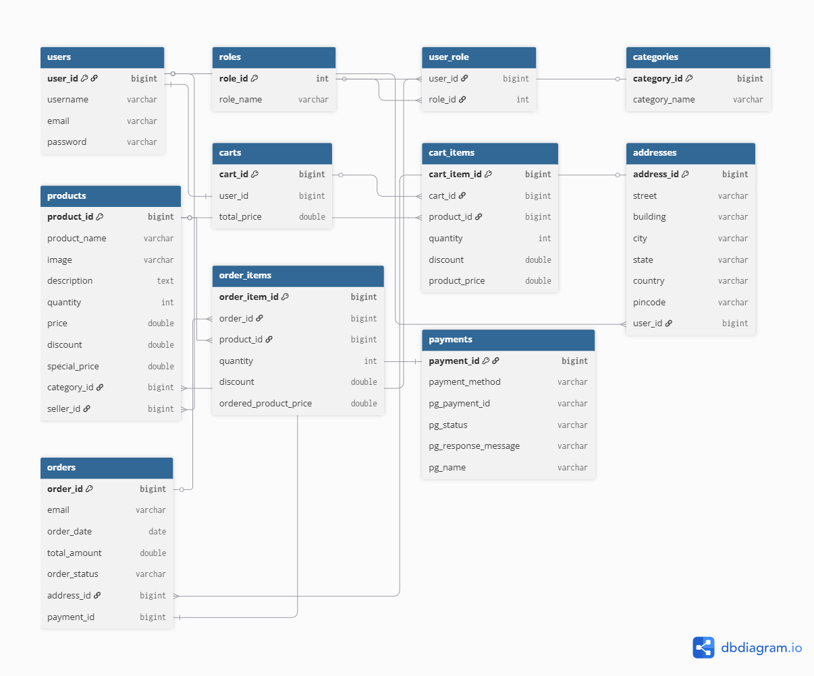
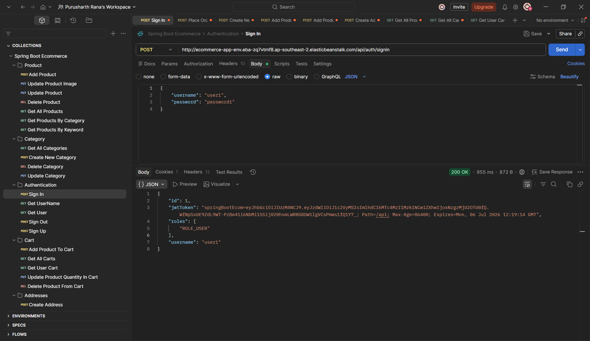
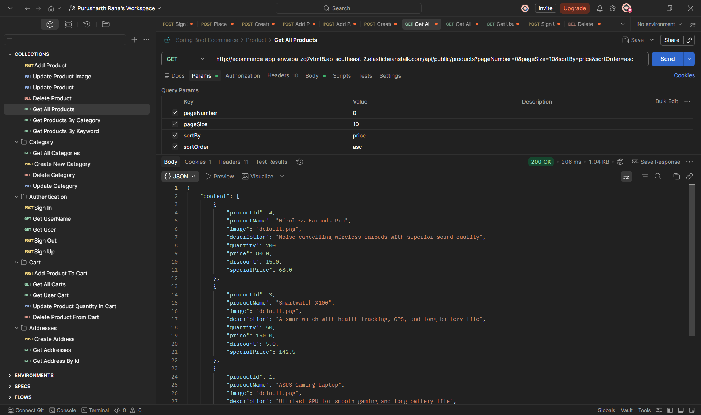
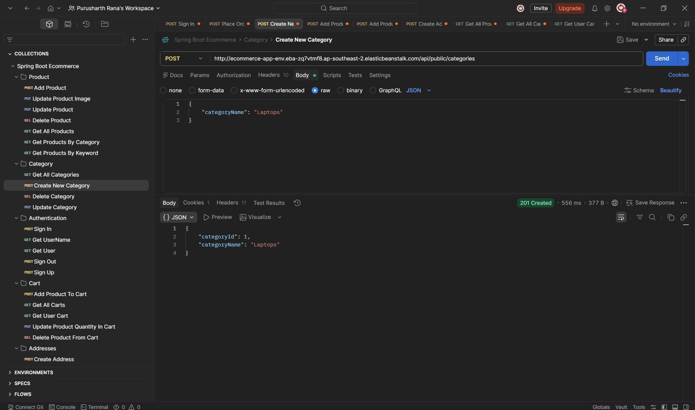
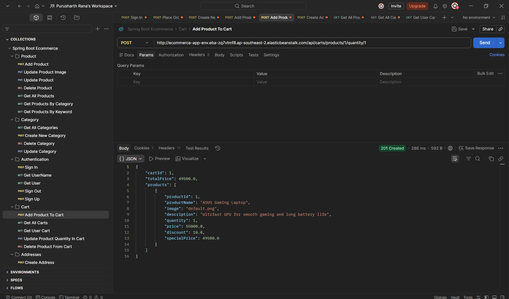
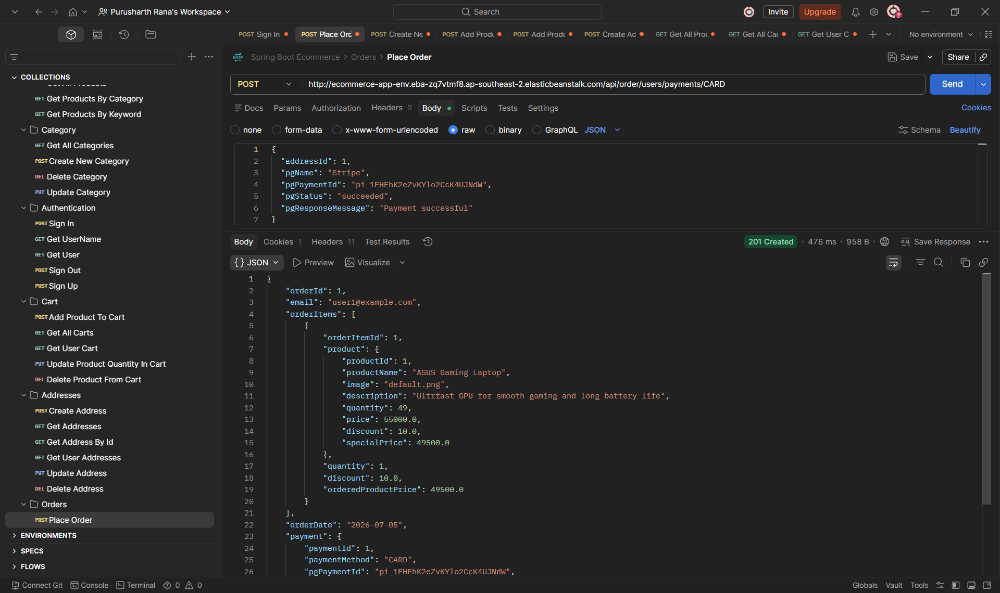
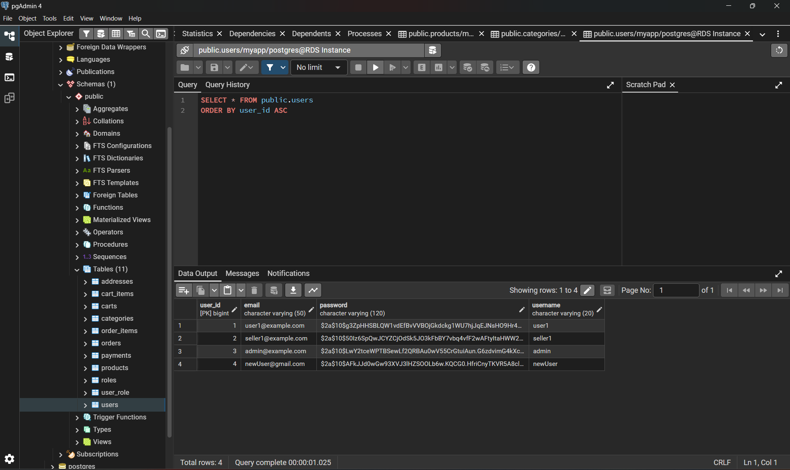
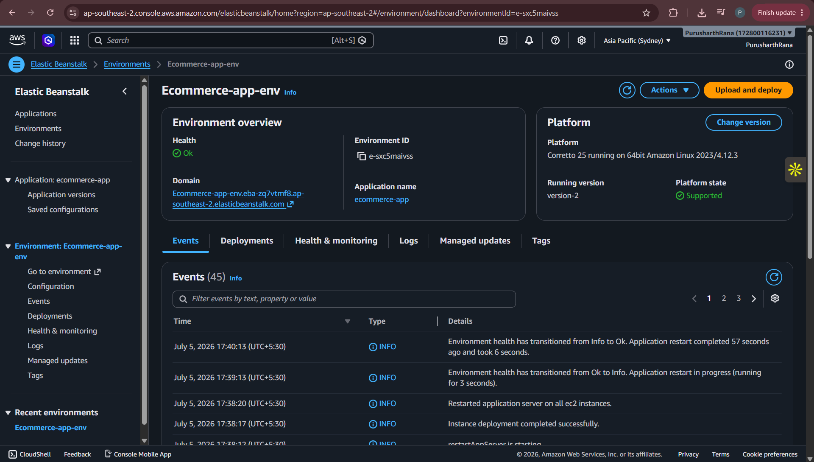

<div align="center">

# 🛒 Spring Boot E-Commerce Platform


</div>

---

---

## 📖 Overview

This repository currently contains the backend of a full-stack E-Commerce platform built using **Spring Boot**. It provides a secure and scalable **RESTful API** for authentication, product and category management, shopping cart operations, address management, order processing, payment handling, and product image uploads.

The application follows a clean **Layered Architecture** (Controller → Service → Repository) with **Spring Security** and **JWT Authentication** securing protected endpoints. Data persistence is handled using **Spring Data JPA**, **Hibernate**, and **PostgreSQL**, while features such as **Bean Validation**, **Global Exception Handling**, **Pagination**, and **Role-Based Access Control** ensure a robust and maintainable backend.

The backend was successfully deployed on **AWS Elastic Beanstalk** with **Amazon RDS (PostgreSQL)** during development. A modern **React** frontend is planned to transform this repository into a complete full-stack E-Commerce platform.

## 🌟 Project Highlights

- 🛒 Complete **E-Commerce Backend** with **25+ RESTful API Endpoints**
- 🔐 Cookie-Based **JWT** Authentication and Authorization
- 👥 **Role-Based Access Control** (User, Seller & Admin)
- 📦 CRUD Operations across Products, Categories, Cart, Addresses & Orders
- 💳 Order Processing with integrated Payment module
- 🏗️ **Layered Architecture** (Controller → Service → Repository)
- 📦 **DTO-Based API Design** using ModelMapper
- 🗄️ **PostgreSQL** with Spring Data JPA & Hibernate
- 🛡️ **Global Exception Handling** and Bean Validation
- 📄 Pagination, Sorting & Product Search
- 🖼️ Multipart File Upload for Product Images
- ☁️ Successfully deployed on **AWS Elastic Beanstalk** with Amazon RDS *(Previously)*


## 🚀 Features

### 🔐 Authentication & Authorization

- User registration and login using JWT authentication
- Secure password encryption with BCrypt
- Cookie-based JWT authentication
- Role-based access control with **User, Seller, and Admin** roles
- Protected REST endpoints using Spring Security

### 📦 Product Management
- Create, update, and delete products
- Upload and manage product images
- Retrieve products with pagination and sorting
- Search products by keyword
- Filter products by category

### 🗂️ Category Management
- Create, update, and delete categories
- Retrieve all available categories
- Associate products with categories

### 🛒 Shopping Cart
- Add products to the cart
- Update product quantities
- Remove items from the cart
- View the authenticated user's cart

### 📍 Address Management
- Add multiple delivery addresses
- Update existing addresses
- Delete saved addresses
- Retrieve user-specific addresses

### 📦 Order Management
- Place orders from the shopping cart
- Store payment details
- Maintain order and order item information

### ⚙️ Backend Features
- Layered Architecture (Controller → Service → Repository)
- DTO-based request and response handling
- Global exception handling
- Bean validation for request payloads
- Image upload support
- RESTful API design
- Clean and modular code structure


## 🛠️ Tech Stack

| Category | Technologies |
|----------|-------------|
| **Language** | Java 21 |
| **Framework** | Spring Boot |
| **Security** | Spring Security, JWT Authentication |
| **Database** | PostgreSQL |
| **ORM** | Hibernate, Spring Data JPA |
| **Build Tool** | Maven |
| **API Testing** | Postman |
| **Image Handling** | Multipart File Upload |
| **Validation** | Jakarta Bean Validation |
| **Architecture** | Layered Architecture, RESTful APIs |
| **Version Control** | Git & GitHub |
| **Deployment** | AWS Elastic Beanstalk *(Previously)*, Amazon RDS *(Previously)* |


## 🏗️ Architecture

The application follows a **layered architecture**, where each layer has a dedicated responsibility. This separation of concerns improves maintainability, scalability, and code readability.

```text
                    Client / Frontend
                           │
                           ▼
                  Spring Security (JWT)
                           │
                           ▼
                    REST Controllers
                           │
                           ▼
                     Service Layer
                    (Business Logic)
                           │
                           ▼
                    Repository Layer
                    (Spring Data JPA)
                           │
                           ▼
                     Hibernate ORM
                           │
                           ▼
                  PostgreSQL Database
```

### Architecture Overview

- **Spring Security** authenticates and authorizes incoming requests using JWT tokens.
- **Controllers** expose REST APIs and handle HTTP requests.
- **Service Layer** contains the core business logic of the application.
- **Repositories** communicate with the database using Spring Data JPA.
- **Hibernate ORM** maps Java entities to relational database tables.
- **PostgreSQL** stores all application data including users, products, carts, orders, addresses, and payments.


## 📂 Project Structure

```text
src
└── main
    ├── java
    │   └── com.ecommerce.project
    │       ├── config
    │       ├── controller
    │       ├── exceptions
    │       ├── model
    │       ├── payload
    │       ├── repositories
    │       ├── security
    │       ├── service
    │       ├── util
    │       └── SbEcommerceApplication.java
    │
    └── resources
        ├── static
        ├── templates
        ├── application.properties.example
        └── application.properties
```

### Package Description

| Package | Description |
|----------|-------------|
| **config** | Spring configuration classes, bean configuration, ModelMapper, and application setup. |
| **controller** | Exposes REST API endpoints and handles HTTP requests. |
| **service** | Contains the business logic and coordinates application workflows. |
| **repositories** | Performs database operations using Spring Data JPA repositories. |
| **model** | Contains all JPA entity classes representing the database schema. |
| **payload** | Request and Response DTOs used for API communication. |
| **security** | Spring Security configuration, JWT authentication, authorization filters, and user authentication logic. |
| **exceptions** | Custom exceptions and global exception handling for standardized API responses. |
| **util** | Utility classes and helper methods used throughout the application. |

The project follows a **Controller → Service → Repository** architecture, ensuring a clear separation between API handling, business logic, and database operations. DTOs are used to decouple the persistence layer from the API layer, resulting in cleaner and more maintainable code.


## 🧩 Core Modules

The application is divided into multiple modules, each responsible for a specific business functionality. This modular approach keeps the codebase organized, maintainable, and easy to extend.

---

### 🔐 Authentication & Authorization

The authentication module is built using **Spring Security** and **JWT (JSON Web Tokens)**. It secures protected APIs while allowing public access only where required.

**Key Features**

- User Registration & Login
- JWT Token Generation
- Cookie-Based JWT Authentication
- Role-Based Authorization (User, Seller & Admin)
- BCrypt Password Encryption
- Protected REST Endpoints

---

### 📦 Product Management

The Product module provides complete CRUD functionality for managing products available on the platform.

**Key Features**

- Create, Update & Delete Products
- Retrieve Products by ID
- View All Products
- Product Search
- Pagination & Sorting
- Product Image Upload

---

### 🗂️ Category Management

Products are organized into categories for easier management and product discovery.

**Key Features**

- Create Categories
- Update Categories
- Delete Categories
- Retrieve Available Categories
- Associate Products with Categories

---

### 🛒 Shopping Cart

Every authenticated user has an individual shopping cart used to manage products before placing an order.

**Key Features**

- Add Products to Cart
- Update Product Quantity
- Remove Products from Cart
- Retrieve Logged-in User's Cart
- Automatic Cart Total Calculation

---

### 📍 Address Management

Users can maintain multiple delivery addresses associated with their accounts.

**Key Features**

- Add New Address
- Update Existing Address
- Delete Address
- View Saved Addresses

---

### 📦 Order Management

Orders are generated from the authenticated user's shopping cart and stored for future reference.

**Key Features**

- Place Orders
- Store Payment Information
- Generate Order Summary
- Maintain Order History

---

### 🖼️ Image Upload

The application supports uploading product images using **Multipart File Upload**, allowing products to be displayed with associated images.

---

### ⚙️ Exception Handling & Validation

To provide consistent API responses, the application implements centralized exception handling and request validation.

**Includes**

- Global Exception Handler
- Custom Exception Classes
- Bean Validation
- Standardized Error Responses


## 🗄️ Database Design

The application uses **PostgreSQL** as its relational database, while **Hibernate ORM** and **Spring Data JPA** handle object-relational mapping and database interactions. The schema is designed to maintain data consistency through well-defined entity relationships and appropriate JPA annotations.

### Core Entities

- 👤 User
- 🛡️ Role
- 📦 Product
- 🗂️ Category
- 🛒 Cart
- 🛍️ CartItem
- 📍 Address
- 📄 Order
- 📋 OrderItem
- 💳 Payment

---

### Entity Relationships



---

### Relationship Summary

| Relationship    | Mapping      |
|-----------------|--------------|
| User → Role     | Many-to-Many |
| User → Product  | One-to-Many  |
| User → Cart     | One-to-One   |
| User → Address  | One-to-Many  |
| Category → Product | One-to-Many  |
| Product → CartItem | One-to-Many  |
| Product → OrderItem | One-to-Many  |
| Cart → CartItem | One-to-Many  |
| Address → Order | One-to-Many  |
| Order → OrderItem | One-to-Many  |
| Order → Payment | One-to-One   |

---

### JPA Features Used

The project makes extensive use of JPA and Hibernate annotations to model relationships and manage persistence.

- `@Entity`
- `@Table`
- `@Id`
- `@GeneratedValue`
- `@OneToOne`
- `@OneToMany`
- `@ManyToOne`
- `@ManyToMany`
- `@JoinColumn`
- `@Enumerated`
- `CascadeType`
- `FetchType`
- `orphanRemoval`

These mappings help maintain referential integrity while simplifying database interactions through Hibernate.


## 📡 REST API Reference

The backend exposes RESTful APIs organized into multiple modules. Each module follows REST principles and uses appropriate HTTP methods for resource creation, retrieval, update, and deletion.

---

### 🔐 Authentication APIs

| Method | Endpoint         | Description                                  |
|:------:|------------------|----------------------------------------------|
|  POST  | `/api/auth/signup` | Register a new user                          |
|  POST  | `/api/auth/signin` | Authenticate user and generate JWT           |
|  POST  | `/api/auth/signout` | Logout the authenticated user                |
|  GET   | `/api/auth/username` | Get the currently authenticated user name    |
|  GET   | `/api/auth/user` | Get the currently authenticated user details |

---

### 🗂️ Category APIs

| Method | Endpoint | Description |
|:------:|----------|-------------|
| GET | `/api/public/categories` | Retrieve all categories |
| POST | `/api/admin/categories` | Create a new category |
| PUT | `/api/admin/categories/{categoryId}` | Update a category |
| DELETE | `/api/admin/categories/{categoryId}` | Delete a category |

---

### 📦 Product APIs

| Method | Endpoint | Description                    |
|:------:|----------|--------------------------------|
| GET | `/api/public/products` | Retrieve all products          |
| GET | `/api/public/categories/{categoryId}/products` | Retrieve products by category  |
| GET | `/public/products/keyword/{keyword}` | Search products by keyword     |
| POST | `/api/admin/categories/{categoryId}/product` | Add a new product              |
| PUT | `/api/admin/products/{productId}` | Update product details         |
| DELETE | `/api/admin/products/{productId}` | Delete a product               |
| PUT | `/api/admin/products/{productId}/image` | Upload or update product image |

---

### 🛒 Cart APIs

| Method | Endpoint | Description                    |
|:------:|----------|--------------------------------|
| GET | `/api/carts` | Retrieve all the carts         |
| GET | `/api/carts/users/cart` | Retrieve logged-in user's cart |
| POST | `/api/carts/products/{productId}/quantity/{quantity}` | Add product to cart            |
| PUT | `/api/carts/products/{productId}/quantity/{operation}` | Update product quantity        |
| DELETE | `/api/carts/{cartId}/product/{productId}` | Remove product from cart       |

---

### 📍 Address APIs

| Method | Endpoint | Description                                |
|:------:|----------|--------------------------------------------|
| GET | `/api/addresses` | Retrieve all saved addresses               |
| GET | `/api/addresses/{addressId}` | Retrieve address details of any user       |
| GET | `/api/users/addresses` | Retrieve address details of logged-in user |
| POST | `/api/addresses` | Add a new address                          |
| PUT | `/api/addresses/{addressId}` | Update an address                          |
| DELETE | `/api/addresses/{addressId}` | Delete an address                          |

---

### 📄 Order APIs

| Method | Endpoint | Description    |
|:------:|----------|----------------|
| POST | `/api/order/users/payments/{paymentMethod}` | Place an order |
| GET | `/api/orders` | In future      |
| GET | `/api/orders/{orderId}` | In future      |

---

### 📊 API Response Features

- RESTful API Design
- JSON Request & Response Format
- DTO-Based Data Transfer
- Bean Validation
- Standardized API Responses
- Global Exception Handling
- Appropriate HTTP Status Codes
- JWT-Protected Endpoints


## 🚀 Getting Started

Follow the steps below to set up and run the project locally.

### Prerequisites

Make sure the following software is installed on your system:

- Java 21 (or later)
- Maven
- PostgreSQL
- Git
- IntelliJ IDEA (Recommended)
- Postman (Optional, for API testing)

---

### 1️⃣ Clone the Repository

```bash
git clone https://github.com/<your-username>/springboot-ecommerce-backend.git
```

Navigate to the project directory.

```bash
cd springboot-ecommerce-backend
```

---

### 2️⃣ Configure the Application

A sample configuration file is provided:

```text
src/main/resources/application.properties.example
```

Create a new file named:

```text
application.properties
```

Copy the contents from the example file and update the following properties:

- PostgreSQL Database URL
- Database Username
- Database Password
- JWT Secret

---

### 3️⃣ Create the Database

Create a PostgreSQL database.

Example:

```sql
CREATE DATABASE ecommerce;
```

Update the datasource configuration inside:

```properties
spring.datasource.url=jdbc:postgresql://localhost:5432/ecommerce
spring.datasource.username=your_username
spring.datasource.password=your_password
```

---

### 4️⃣ Install Dependencies

```bash
mvn clean install
```

---

### 5️⃣ Run the Application

Using Maven:

```bash
mvn spring-boot:run
```

or directly from your IDE by running:

```text
SbEcommerceApplication.java
```

The application will start on:

```text
http://localhost:8080
```

---

### 6️⃣ Test the APIs

Use **Postman** (or any REST client) to test the available endpoints.

Protected APIs require authentication using a valid JWT token generated after user login.

---

## ⚙️ Configuration

The project uses Spring Boot configuration through the `application.properties` file.

### Database

```properties
spring.datasource.url=jdbc:postgresql://localhost:5432/ecommerce
spring.datasource.username=your_username
spring.datasource.password=your_password
```

### JWT Configuration

```properties
spring.app.jwtSecret=your_jwt_secret
spring.app.jwtExpirationMs=3000000
spring.ecom.app.jwtCookieName=springBootEcom
```

### Hibernate

```properties
spring.jpa.hibernate.ddl-auto=update
spring.jpa.database-platform=org.hibernate.dialect.PostgreSQLDialect
```

> **Note:** Never commit your actual `application.properties` file. A sanitized `application.properties.example` is included in this repository for reference.

---

## ☁️ Deployment

This backend was successfully deployed on **AWS Elastic Beanstalk** using **Amazon RDS (PostgreSQL)** as the managed database service.

During deployment, the following AWS services and concepts were used:

- AWS Elastic Beanstalk
- Amazon RDS for PostgreSQL
- EC2 Instances
- Security Groups
- Application Packaging (Executable JAR)
- Environment Variables
- VPC Networking
- Spring Boot Production Configuration

During deployment, the application was packaged as an executable JAR, deployed to AWS Elastic Beanstalk, connected to Amazon RDS (PostgreSQL), and configured using Elastic Beanstalk environment settings. Database connectivity, security groups, and networking issues were resolved during deployment.

> **Note:** The AWS resources were later terminated to avoid unnecessary cloud charges after successfully completing the deployment and testing process.


## 📸 Screenshots

The screenshots below highlight the core modules, REST APIs, database integration, and cloud deployment of the application.

| Feature | Preview                                             |
|---------|-----------------------------------------------------|
| Authentication |                |
| Product APIs |             |
| Category APIs |                 |
| Shopping Cart |              |
| Order APIs |                     |
| PostgreSQL Database |          |
| AWS Deployment |  |

> **Note:** API testing was performed using **Postman**, and the backend was previously deployed on **AWS Elastic Beanstalk** with **Amazon RDS (PostgreSQL)**.

---

## 🔮 Future Improvements

The backend has been designed to be easily extensible. Some planned enhancements include:

- ⚛️ React-based Frontend
- 💳 Payment Gateway Integration (Stripe)
- 🔍 Advanced Product Filtering & Search
- ⭐ Product Ratings & Reviews
- ❤️ Wishlist Functionality
- 📧 Email Notifications
- 📄 Swagger / OpenAPI Documentation
- 🐳 Docker Containerization
- 🚀 CI/CD Pipeline using GitHub Actions
- ☁️ Image Storage using AWS S3

---

## 👨‍💻 Author

**Purusharth Rana**

B.Tech in Information Technology, IIIT Una

---

⭐ If you found this project interesting, consider giving it a star. Feedback and suggestions are always appreciated!